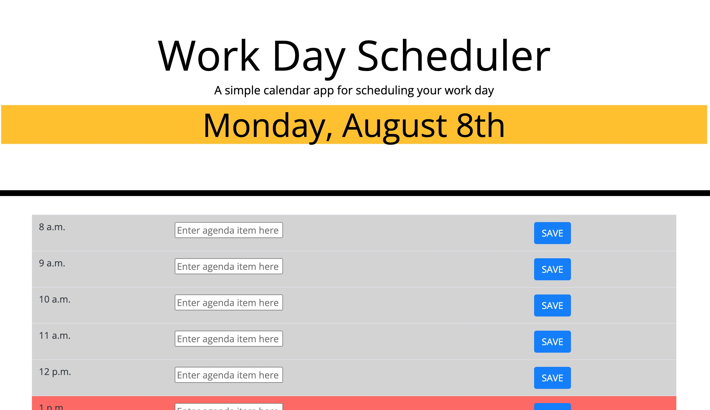

# Module-5-Challenge
Workday Scheduler

# Description

This repository contains HTML, CSS, and JAVASCRIPT files for a program that creates a daily planner for an employee to use to enter agenda items for each hour of the work day. When the user opens the program, the current day is displayed at the top of the calendar. When the user scrolls down, the user sees rows for each hour of the work day (8-5 p.m.). Each row is color coded to indicate if the hour is in the past, present, or future. When the user clicks into the timeblock row, the user can enter an event. When the user clicks the save button, each event is saved in local storage, and the saved events persist on the page after refresh.

# Screenshot

# Link to Application

[Jack Warrick's daily scheduler program](https://jackwarrick.github.io/Module-5-Challenge/)

